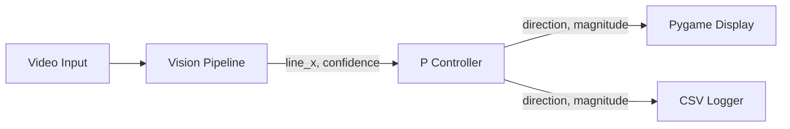

# rpi-line-follower

A Python-based robot controller that uses computer vision to follow a line. Fully simulated — no hardware needed.

## Background

During my bachelor's degree, I built a line-following robot car for the DLD course project using hardware components. This repo is a software simulation of the same concept, built to revisit and extend that work using Python, OpenCV, and Pygame.

## How It Works



Each frame from the video is processed by the vision pipeline to find the line position. The controller computes a steering command based on how far the line is from the center. The simulator visualizes the robot following the track in real time.

## Vision Pipeline

1. Convert frame to grayscale
2. Apply Gaussian blur (5×5) to reduce noise
3. Binary threshold (inverted) — dark line on light background becomes white on black
4. Find contours in the thresholded image
5. Select the largest contour by area
6. Compute centroid using image moments → `line_x`
7. Confidence = contour area / frame area

## Controller

Uses a simple proportional (P) controller:

```
error     = line_x - frame_center_x
magnitude = kp * |error|
direction = "left"  if error < 0
          = "right" if error > 0
          = "straight" if magnitude < threshold
```

Default `kp = 0.5`. Adjustable via `--kp` flag.

## Tech Stack

- Python 3.11+, OpenCV, Pygame, NumPy

## Setup & Installation

```bash
# Clone the repo
git clone https://github.com/sabbas525/rpi-line-follower.git
cd rpi-line-follower

# Install dependencies
pip install -r requirements.txt

# Generate the synthetic track video
python tracks/generate_track.py
```

## Usage

```bash
# Run with Pygame visualization
python src/main.py --simulate

# Run with a specific video file
python src/main.py --video tracks/track1.mp4 --simulate

# Log steering decisions to CSV
python src/main.py --log output.csv

# Adjust proportional gain
python src/main.py --kp 0.8 --simulate

# Headless mode (no display, logging only)
python src/main.py --headless --log output.csv
```

## Project Structure

```
rpi-line-follower/
  src/
    vision.py        # Frame processing, line detection
    controller.py    # Proportional steering logic
    simulator.py     # Pygame visualization
    main.py          # Entry point, CLI args
  tracks/
    generate_track.py  # Generates synthetic track video
  tests/
    test_vision.py
    test_controller.py
  requirements.txt
  requirements-dev.txt
```

## Running Tests

```bash
pip install -r requirements-dev.txt
PYTHONPATH=. pytest
```

## Future Improvements

- Hardware integration with Raspberry Pi + Pi Camera
- Full PID controller (add integral and derivative terms)
- Obstacle detection and avoidance
- Support for curved track detection using Hough transforms
- Real-time webcam input
